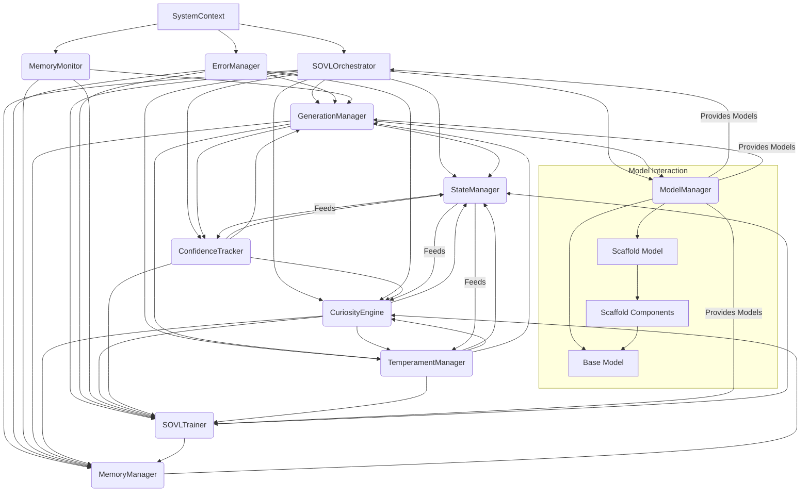

# SOVL System Architecture Overview

## Introduction

The Self-Organizing Virtual Lifeform (SOVL) system is an autonomous, curiosity-driven AI framework that integrates multiple language models with dynamic state tracking. At its core, SOVL uses interconnected systems—including confidence metrics, curiosity impulses, and temperament modulation—to guide its exploration, learning, and knowledge consolidation. A key feature is its sleep/gestation cycle, where the system pauses active exploration to focus on internal processing, memory consolidation, and adaptive retraining, mirroring biological learning patterns.

During these sleep/gestation phases, SOVL optimizes its neural architecture, strengthens important memory associations, and recalibrates its parameters based on accumulated experiences. This cyclical process of active exploration followed by restorative consolidation enables more efficient learning and long-term stability. The system's scaffolded model architecture and cross-attention mechanisms further enhance this by providing structured guidance during both active and dormant phases.

## System Organization

The system is organized around a central `SystemContext` that manages shared resources and coordinates component interactions:

*   **`SystemContext`**: Core container for system-wide resources and configuration
    * Manages configuration validation and updates
    * Coordinates event dispatching
    * Provides shared logging and error handling
    * Maintains system-wide state synchronization

*   **`ErrorManager`**: Comprehensive error handling and recovery system
    * Handles training, curiosity, memory, generation, and data errors
    * Implements automatic recovery strategies
    * Adjusts system parameters in response to errors
    * Maintains error history and statistics

*   **`MemoryMonitor`**: System resource management
    * Monitors memory health and usage
    * Coordinates with training and generation components
    * Implements memory optimization strategies

## Core Components

*   **`SOVLOrchestrator`**: Central coordination system
    * Manages system initialization and shutdown
    * Coordinates component interactions
    * Handles state synchronization
    * Implements error recovery strategies
    * Manages configuration updates
    * Provides CLI interface for system interaction
    * Handles system state persistence and recovery

*   **`GenerationManager`**: Text generation and scaffold integration
    * Manages base and scaffold model interactions
    * Implements dynamic parameter adjustment
    * Handles memory optimization during generation
    * Manages temperament and confidence-based generation
    * Implements repetition detection and handling
    * Provides context-aware generation parameters
    * Manages cross-attention mechanisms

*   **`ModelManager`**: Loads, configures, and provides access to the base and scaffold language models.
*   **`Scaffold Components` (`ScaffoldProvider`, `ScaffoldTokenMapper`, `CrossAttentionInjector`)**: Facilitate the interaction between the scaffold model and the base model, typically guiding the base model's generation via cross-attention mechanisms.
*   **`StateManager` (`SOVLState`)**: Tracks and manages the system's dynamic internal state, including metrics like novelty, confidence, and temperament, which influence overall behavior.
*   **`MemoryManager`**: Stores, retrieves, and manages the system's experiences or memories, playing a key role in learning, consolidation, and novelty detection.
*   **`CuriosityEngine` (`sovl_curiosity`)**: Calculates the system's curiosity based on internal state (novelty, ignorance). High curiosity drives exploration by triggering targeted learning cycles or generating probing questions, making the system dynamically seek new information.
*   **`ConfidenceTracker` (`sovl_confidence`)**: Monitors the confidence of the model's outputs. Low confidence can dynamically trigger learning, influence curiosity, or adjust generation parameters (like temperature) to promote exploration or caution.
*   **`TemperamentManager` (`sovl_temperament`)**: Models the system's internal "mood" (e.g., eager, sluggish). Temperament dynamically influences other systems, potentially affecting learning rate, curiosity thresholds, dream patterns, or generation temperature, adding another layer of behavioral variability.
*   **`SOVLTrainer` (`sovl_trainer`)**: Executes model training steps with advanced lifecycle management:
    * **Sleep/Gestation System**: 
      * Implements biologically-inspired learning cycles with distinct active and dormant phases
      * During sleep phases, performs memory consolidation and neural optimization
      * Gestation phases focus on internal processing and parameter recalibration
      * Dynamically triggered by confidence levels, accumulated experience, or explicit commands
    * **Training Workflow**:
      * Manages standard training cycles with scaffold model integration
      * Handles specialized sleep training for memory consolidation
      * Implements dream cycles for experience replay and novelty reinforcement
      * Coordinates with CuriosityEngine for exploration-driven learning
    * **Lifecycle Management**:
      * Tracks data exposure and model capacity
      * Adjusts learning intensity based on lifecycle stage
      * Implements sigmoid-based lifecycle weighting for gradual transitions
    * **Dynamic Adaptation**:
      * Adjusts training parameters based on confidence and temperament
      * Modifies learning rates and warmup periods according to system mood
      * Implements memory-aware batch sizing and gradient accumulation

## Training Subsystems

*   **Dream Memory System**:
    * Thread-safe memory management for storing and retrieving dream experiences
    * Implements novelty-based memory weighting and automatic pruning
    * Applies temperament-adjusted noise to stored memories
    * Maintains memory decay and capacity limits

*   **Lifecycle Manager**:
    * Tracks model exposure to data and compute resources
    * Calculates lifecycle weights using configurable curves (sigmoid/exponential)
    * Adjusts training intensity based on lifecycle stage
    * Coordinates with temperament system for mood-aware learning

*   **Training Workflow Manager**:
    * Orchestrates standard training, sleep training, and gestation cycles
    * Handles event logging and state updates for each cycle type
    * Manages batch preparation and scaffold integration
    * Implements dry-run capabilities for testing

## Sleep/Gestation Mechanics

The sleep/gestation system implements several key mechanisms:

1. **Phase Triggers**:
   * Automatic triggering based on confidence thresholds
   * Manual triggering via CLI commands
   * Scheduled triggering after specific compute intervals

2. **Memory Processing**:
   * Experience replay from dream memory
   * Novelty reinforcement through weighted sampling
   * Memory pruning and optimization

3. **Neural Optimization**:
   * Parameter recalibration with reduced learning rates
   * Gradient noise injection for regularization
   * Attention pattern refinement

4. **State Synchronization**:
   * Coordinated pausing of active components
   * Resource reallocation for consolidation
   * Gradual reactivation with updated parameters

## Command Line Interface (CLI)

The system provides a comprehensive CLI for interaction and control:

*   **`CommandHandler`**: Manages user commands and system responses
    * Provides command history and search functionality
    * Implements command validation and execution
    * Handles system status and configuration display
    * Manages debug and monitoring commands

*   **Command Categories**:
    * System: quit, exit, save, load, reset, status, help, monitor
    * Training: train, dream
    * Generation: generate, echo, mimic
    * Memory: memory, recall, forget, recap
    * Interaction: muse, flare, debate, spark, reflect
    * Debug: log, config, panic, glitch
    * Advanced: tune, rewind
    * History: history

## Configuration Management

The system uses a robust configuration management system:

*   **`ConfigManager`**: Central configuration management
    * Validates configuration values and ranges
    * Manages configuration updates and persistence
    * Provides type-safe configuration access
    * Implements configuration change notifications
    * Handles configuration profiles and tuning

*   **Configuration Sections**:
    * core_config: Base system configuration
    * training_config: Training parameters and settings
    * curiosity_config: Curiosity engine settings
    * cross_attn_config: Cross-attention mechanism settings
    * controls_config: System control parameters
    * lora_config: LoRA adapter settings
    * orchestrator_config: Orchestrator-specific settings

## Core Workflow & Dynamic Interactions

The system operates through a layered architecture:

1. **Initialization Layer**:
   * `SystemContext` initializes and validates configuration
   * Components are initialized with shared resources
   * Event dispatcher establishes communication channels
   * `SOVLOrchestrator` coordinates component setup

2. **Operation Layer**:
   * `SOVLOrchestrator` directs system operation using models from `ModelManager`
   * `GenerationManager` handles text generation with scaffold integration
   * `ConfidenceTracker` assesses output confidence
   * `TemperamentManager` updates system mood based on activity
   * `MemoryMonitor` ensures resource availability

3. **Learning Layer**:
   * High curiosity or low confidence triggers `SOVLTrainer`
   * Sleep/Gestation phases enable focused training
   * Temperament modulates learning intensity
   * Error handling and recovery maintain system stability
   * Memory consolidation occurs during dream cycles

4. **Memory Layer**:
   * Experiences stored in `MemoryManager`
   * Dream cycles consolidate memories
   * Novelty detection influences curiosity
   * State history informs future decisions
   * Memory optimization strategies are applied

## Core Interaction Diagram

## Reasoning for Inclusion/Exclusion

This expanded overview maintains focus on core logic but integrates the dynamic state systems (Confidence, Curiosity, Temperament) and the Sleep/Gestation learning mechanism as requested, explaining their direct impact on the system's behavior and learning loop.

*   **Included**: `SystemContext`, `ErrorManager`, `MemoryMonitor`, `SOVLOrchestrator`, and `GenerationManager` were added to reflect the system's organization and error handling capabilities. `ConfidenceTracker`, `TemperamentManager`, and details on `CuriosityEngine` and `SOVLTrainer` (Sleep/Gestation) were included because they are central to the system's dynamic adaptation and decision-making regarding learning and generation.
*   **Excluded**: Details remain excluded for auxiliary functions like logging (`Logger`), error handling (`ErrorManager`), detailed configuration (`ConfigManager`), CLI (`CommandHandler`), monitoring (`SystemMonitor`), and general utilities (`sovl_utils`), as they support rather than constitute the core dynamic logic.

*   **Relevant Modules**: The analysis now incorporates insights from `sovl_main.py`, `sovl_conductor.py`, `sovl_generation.py`, `sovl_trainer.py`, `sovl_confidence.py`, `sovl_curiosity.py`, and `sovl_temperament.py`, in addition to the previously listed modules.
